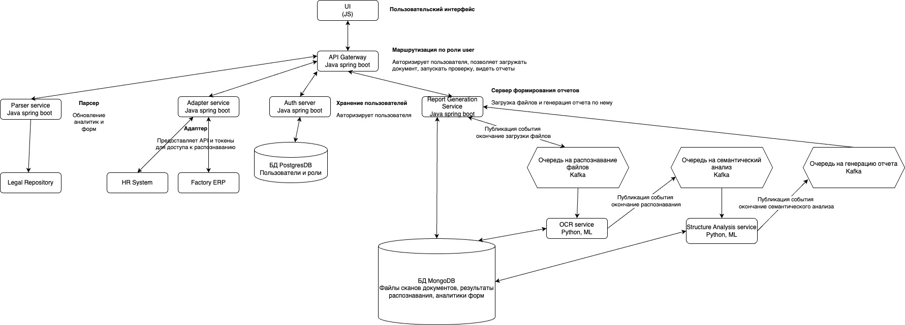

# Регламент разработки

## Базовые правила

1. Сначала думай, потом делай.
2. Сомневаешься — уточняй. Глупых вопросов не бывает. К тому же, предположение — мать всех неудач.
3. Насорил — прибери за собой. После доработок код должен оставаться в чистоте и порядке.

## Кредо разработчика

Основное кредо, которых должен придерживаться разработчик:


| Значение | Перевод |
|----------|---------|
| **[KISS](https://en.wikipedia.org/wiki/KISS_principle)** | Keep it short and simple. Не усложняй код без веской причины. |
| **[SOLID](https://en.wikipedia.org/wiki/SOLID)** | Single responsibility, open-closed, Liskov substitution, interface segregation & dependency inversion. Набор основных принципов объектно-ориентированных проектирования и программирования. |
| **[GRASP](https://en.wikipedia.org/wiki/GRASP_(object-oriented_design))** | General Responsibility Assignment Software Patterns. Набор шаблонов распределения ответственности. |
| **[YAGNI](https://en.wikipedia.org/wiki/You_aren%27t_gonna_need_it)** | You aren’t gonna need it. «Вам это не понадобится». Не нужно делать то, что не просили. Подход «возможно в будущем понадобится» сильно усложняет код и поддержку. |

---

## Организация кода

Настоятельно рекомендуется использовать **Clean architecture** для организации системного инженерного подхода к архитектуре.

В каждом микросервисе имеется определенное число пакетов. Перед тем как добавлять пакеты, необходимо ознакомиться с существующей организацией пакетов и именованием, чтобы избежать лишних пересечений. **Пакеты должны включать только полезную логику**, не являясь просто «контейнером». 



# Уникальный идентификатор проекта

**groupId** - `ru.aidoc.{namespace}`  
**artifactId** - `(имя сервиса)`

**Пример:**<br>
groupId: ru.aibok.auth
<br>
artifactId: authentication-service


## Стиль кода

### Code Style Java
Мы придерживаемся **Google Java Style Guide** через плагин [Google Java Code Formatter](https://github.com/google/google-java-format) в **IntelliJ IDEA**.

### Code Style Python с использованием аннотации типов

### Общие рекомендации
1. **Прописывайте все типы данных** для аргументов и возвращаемого значения функций.
2. Используйте стандартный модуль `typing` для сложных типов данных (например, `List`, `Dict`, `Optional`).
3. Следуйте официальным рекомендациям **PEP 8** (общий стиль кода) и **PEP 484** (аннотации типов).
4. Используйте инструменты статической проверки типов, такие как **mypy**, для проверки соответствия аннотаций.

---

### Пример оформления функции с аннотацией типов

```python
from typing import List, Dict, Optional, Union

def calculate_total(items: List[Dict[str, Union[int, float]]]) -> float:
    """
    Функция для расчета общей суммы из списка элементов.

    :param items: Список словарей, где ключи — строки, значения — числа.
    :return: Общая сумма как float.
    """
    total: float = 0.0
    for item in items:
        total += sum(item.values())
    return total
```

## Основные рекомендации:

1. **Принципы читаемости и оптимизации:**
   - В организации кода придерживайтесь простоты и избегайте использования антипаттернов.
   - Оптимизация кода не должна ухудшать читаемость, избегайте "ранней оптимизации".

2. **Обработка ошибок:**
   - Используйте исключения для обработки ошибок.
   - Избегайте пустых `catch` блоков или игнорирования вызовов.

3. **DRY (Don't Repeat Yourself):**
   - При добавлении новых библиотек обсудите необходимость с командой.
   - Для повторяющихся операций используйте готовые методы из библиотек, а не пишите их вручную.
   - **Пример:** Для работы со строками используйте `StringUtils`.

4. **Работа с большими текстами:**
   - Для разделения большого текста используйте перенос на отдельные строки или механизмы форматирования, такие как `String.format`.

5. **Именование переменных и объектов:**
   - Ключевое слово должно быть отражено в имени объекта или переменной.
   - Используйте четкие и понятные названия переменных.

---
## Статический импорт
- Если статический метод/константа используется часто и уникальна в проекте, допустим статический импорт.
- В остальных случаях следует обращаться к методам/константам с указанием имени класса для повышения читаемости.

---

## Использование интерфейсов
- Создание интерфейсов обосновано только для случаев:
  - Организация логики с возможностью множественной реализации.
  - Поддержка принципов "чистой архитектуры".
- Интерфейсы должны быть самодостаточными и не содержать реализации.
- Если метод используется только в одном месте, интерфейс не требуется.

---

## Лямбда-выражения
- Если логика метода проста и коротка, допустимо использовать лямбда-выражения.
- Сложные лямбда-функции рекомендуется выносить в отдельные методы для повышения читаемости.

---

## Функции как параметры
- Используйте функции в качестве параметров, если это упрощает структуру кода.
- Избегайте избыточной вложенности вызовов.

---


## Использование аббревиатур

Избегайте использования аббревиатур в именах переменных, методов, классов и других элементов кода.  
Некоторые команды создают собственные аббревиатуры, которые могут быть понятны только членам команды, но абсолютно непонятны для новых участников. Аббревиатуры ухудшают читаемость кода.

**Пример плохой практики:**
```java
public enum ResourceType {
    EXTERNAL,
    CS
}
```
Что такое CS? Это может быть CaseSensitive, CommonString, CounterStrike? Без контекста это не ясно.

Рекомендация: Используйте полные, осмысленные имена для всех элементов кода. Например:

```java
public enum ResourceType {
    EXTERNAL,
    CUSTOMER_SERVICE
}
```

# Тестирование

Все публичные методы должны быть покрыты модульными тестами. Как говорится, "доверяй, но проверяй": один модульный тест на метод — чем тысяча заверений в его работоспособности. В требованиях писать модульные тесты мы руководствуемся следующей эффективностью:
- Написание теста занимает 10 минут, а обнаружение багов и последующее устранение багов разработчиком может занимать от часа и более.
- Поэтому мы пишем модульные тесты, чтобы минимизировать затраты на последующие доработки кода.

### Организация тестов:
1. **Подготовка данных:** создается минимальный набор объектов и данных для тестирования.
2. **Тестирование функциональности:** выполняется проверка логики.
3. **Сравнение возвращаемого значения от вызовов функций**: assert


## Три этапа тестирования
Каждый тест состоит из трех этапов:
1. Подготовка данных.
2. Тестирование проверяемой функциональности.
3. Проверка полученных результатов.

## Правило документирования микросервиса

Каждый микросервис должен содержать файл **README.md** в корневой папке своего проекта. Документ должен предоставлять полное описание микросервиса и его логики, чтобы упростить понимание и поддержку другим разработчикам.

### Структура README.md
1. **Название микросервиса**  
   - Краткое описание, что делает данный микросервис.

2. **Назначение**  
   - Основные цели и задачи микросервиса.
   - Какую проблему решает данный сервис.

3. **Архитектура и логика работы**  
   - Описание общей архитектуры микросервиса.
   - Блок-схемы, если применимо.
   - Основные этапы обработки данных.

4. **Описание API**  
   - Список доступных эндпоинтов с примерами запросов и ответов.
   - Формат данных (JSON, XML и т.д.).
   - Коды ответа HTTP.

5. **Зависимости**  
   - Список основных внешних библиотек, модулей и других микросервисов, с которыми происходит интеграция.

6. **Запуск и настройка**  
   - Инструкция по локальному запуску микросервиса.
   - Переменные окружения (например, `.env`), которые необходимо настроить.
   - Команды для запуска через Docker (если применимо).

7. **Миграции базы данных** (если есть)  
   - Описание использования инструментов миграции (например, Alembic, Flyway).
   - Инструкция по запуску миграций.

8. **Мониторинг и логирование**  
   - Информация о механизме логирования.
   - Метрики мониторинга (если есть).

9. **Тестирование**  
   - Как запускать тесты.
   - Информация о покрытии кода тестами.


# Трекинг задач и планирование

## Подход к планированию
В нашей команде один спринт длится **1 неделю**. Мы следуем следующему процессу:

1. **Перед началом спринта:**  
   - Составляется план задач, который включает цели и задачи, которые команда намерена выполнить в течение недели.

2. **В течение спринта:**  
   - Каждый участник фокусируется на выполнении задач согласно приоритетам, определенным в начале недели.
   - Регулярно решаются текущие вопросы, чтобы обеспечить бесперебойную работу.

3. **Суббота — обсуждение открытых вопросов:**  
   - Выделяется время для обсуждения проблем или нерешенных вопросов, связанных с задачами спринта.

4. **Воскресенье — демо:**  
   - Каждый участник команды демонстрирует свои успехи за спринт в течение 5–7 минут.  
   - Цель демо: показать выполненную работу, обсудить достижения и получить обратную связь.

5. **После завершения спринта:**  
   - Команда анализирует выполненную работу.  
   - Определяет, что можно улучшить для повышения эффективности и качества в следующем спринте.

---

## Жизненный путь задачи

Каждая задача проходит следующие этапы:

1. **Требует выполнения:**  
   - Задача запланирована, но еще не начата.

2. **В работе:**  
   - Задача активно выполняется исполнителем.

3. **На ревью:**  
   - Работа над задачей завершена, и она находится на проверке (ревью).

4. **Выполнена:**  
   - Задача успешно завершена, все проверки пройдены.

---

## Пример использования
- План задач и трекинг их статусов ведется в **GitHub issues** [https://github.com/Stepan5024/Find-My-Doc/issues] 
- Этапы выполнения задачи визуализируются через канбан-доску, чтобы вся команда могла видеть текущее состояние работы [https://github.com/users/Stepan5024/projects/2].

---

**Результат:** Такой подход к планированию и трекингу задач позволяет команде эффективно достигать поставленных целей и регулярно улучшать процессы работы.

# Работа с ветками удаленного репозитория

## Схема ответвления: Find-My-Doc

- **Релизная ветка:** `main`
- **Основная ветка:** `develop`
- **Рабочие ветки:** `feature/создать-авторизацию`, `feature/написать-тесты`

### Ветки для разработки:
- `bugfix/логирование-не-работает`
- `feature/создать-авторизацию`

Пример: В ветке `feature/создать-авторизацию` разработка новых функций, в `bugfix/логирование-не-работает` — исправление багов.

**Ветка прикрепляется к GitHub issues**
---

## Основные правила работы с ветками

### Сообщение коммита
Сообщение должно содержать:
- **Текст коммита**  
  Пример: `Добавлен метод для обработки запросов`

### Правила именования веток
- Для **патчей** (исправления багов):  
  Ветка формируется по шаблону: `bugfix/<что-правится>`  
- Для **фич**:  
  Ветка формируется по шаблону: `feature/<что-новое-делается>`  
- Используется **kebab-case**:  
  Все буквы строчные, слова разделяются дефисом (например, `bugfix/что-новое-создается`).

---

### Работа с релизными ветками
1. **Основная разработка** ведется в `develop`.  
2. Все изменения отправляются через **Pull Request (PR)** в `develop`.  
3. Изменения фиксируются через ревью **Степаном** @Stepan5024, после чего происходит слияние ветки.

### Мердж веток:
- Из `develop` периодически создается релизная ветка (`main`).
- После успешного мерджа релиза в продакшен, баги и изменения отправляются в релизные ветки или основную (`develop`).

---

## Требования к Pull Request
1. Каждый PR проходит **код-ревью**, которое включает:
   - Анализ работоспособности кода.
   - Проверку корректности исполнения задачи.
2. Сообщение PR должно быть информативным:
   - Указывает номер задачи.
   - Описывает изменения.
   - Если вносятся изменения в UI или документацию, нужно добавить ссылки на соответствующие материалы.

---

## При написании кода необходимо ориентироваться на:
- **Стиль кода:** Используйте `eslint` и `prettier` для JavaScript и аналогичные инструменты для Java.
- **Юнит-тесты:** Используйте библиотеки (например, `JUnit`, `Mockito` для Java).
- **Документация:** Обязательно добавляйте комментарии к методам и классам. Описывайте работу сервиса в README.md
- **Масштабируемость:** Убедитесь, что код тестируем


## Соглашение по наименованию

1. **JSON:**  
   Имена полей в JSON пишутся в `camelCase`.
2. **DB:**  
   Имена полей в database пишутся в `snake_case`.
3. **URL:**  
   Имена полей в URL пишутся в `kebab-case`.
4. **Kafka:**  
   Наименования топиков пишутся в `camelCase`.


## В Python:

1. **Переменные:**  
   - Используется стиль `snake_case`.

2. **Константы:**  
   - Используется стиль `UPPER_SNAKE_CASE`.

3. **Классы:**  
   - Используется стиль `CamelCase`.

4. **Методы:**  
   - Используется стиль `snake_case`.

5. **Функции:**  
   - Используется стиль `snake_case`.

6. **Модули и пакеты:**  
   - Используется стиль `snake_case`.

7. **Классы исключений:**  
   - Используется стиль `CamelCase`, при этом название должно быть суффиксировано на `Error` или `Exception`.

8. **Типы данных:**  
   - Используется стиль `CamelCase` (например, `UserProfile`, `OrderItem`).

9. **Приватные переменные и методы:**  
   - Префикс `_` для обозначения приватных переменных и методов.

10. **Глобальные переменные:**  
    - Используется стиль `snake_case`, но с префиксом `g_`.

---

## В Java:

1. **Переменные:**  
   - Используется стиль `camelCase`.

2. **Константы:**  
   - Используется стиль `UPPER_SNAKE_CASE`.

3. **Классы:**  
   - Используется стиль `CamelCase`.

4. **Методы:**  
   - Используется стиль `camelCase`.

5. **Функции:**  
   - Используется стиль `camelCase`.

6. **Пакеты:**  
   - Используется стиль `lowercase` (все буквы строчные, разделяются точками).

7. **Интерфейсы:**  
   - Используется стиль `CamelCase`, обычно с префиксом `I` (например, `IService`).

8. **Абстрактные классы:**  
   - Используется стиль `CamelCase`, часто с префиксом `Abstract` (например, `AbstractController`).

9. **Приватные переменные и методы:**  
   - Префикс `m_` для приватных переменных, а для методов — префикс `private`.

10. **Глобальные переменные:**  
    - Используется стиль `camelCase` с префиксом `g_`.

## 1.3. Back-end

### Правила и критерии code-review:

#### Соблюдение стиля кодирования:
- (В случае, если в сборке не настроен автоматический анализатор кода): Отступы и форматирование: проверьте, что код правильно отформатирован и использует правильные отступы.
- Именование переменных и методов: убедитесь, что имена переменных и методов ясны и соответствуют установленным соглашениям.

#### Обработка ошибок и исключений:
- Проверка входных данных и валидация: убедитесь, что входные данные корректно проверяются и валидируются перед использованием.
- Обработка исключений: проверьте, что исключения обрабатываются правильно и сообщения об ошибках ясны и информативны.

#### Безопасность:
- Проверка наличия аутентификации и авторизации: убедитесь, что доступ к защищённым ресурсам контролируется с использованием правильных механизмов аутентификации и авторизации.
- Предотвращение уязвимостей: проверьте наличие защиты от уязвимостей, таких как инъекции SQL, XSS-атаки и другие.

#### Производительность:
- Оптимизация запросов к базе данных: проверьте, что запросы к базе данных выполняются эффективно и используют необходимые индексы.
- Кэширование: убедитесь, что данные, которые могут быть закэшированы, кэшируются для улучшения производительности.

#### Логирование:
- Проверьте, что логирование настроено правильно и сообщения логов содержат достаточную информацию для отладки и анализа проблем.

#### Тестирование:
- Убедитесь, что код покрыт тестами, включая модульные, интеграционные и end-to-end тесты.
- Проверьте, что тесты покрывают целевой функционал и учитывают граничные условия.

#### Архитектура и проектирование:
- Проверьте, что архитектура приложения соответствует установленным стандартам и принципам проектирования.
- Убедитесь, что модули приложения правильно разделены и не зависят друг от друга.


## Нейминг объектов БД

1. Запрещено использовать зарезервированные слова PostgreSQL в качестве наименований.
2. Схема должна соответствовать третьей нормальной форме (3NF) или обеспечивать денормализацию.
3. Максимальная длина названий объектов – 63 символа.
4. Наименования объектов должны быть в **snake_case** и латиницей.
5. Использовать в названиях только английские слова.
6. В названиях допустимо использование только букв, цифр и символа подчеркивания.
7. Названия объектов должны быть уникальными в пределах схемы.
8. Не использовать множественное число. Если же его нужно использовать, то только там, где оно отражает бизнес-логику.
9. Названия таблиц должны быть существительными в единственном числе.
10. Таблицы, используемые для связи "многие-к-многим", должны называться: `имя_таблицы1_имя_таблицы2_link`.
   - В такой таблице должно быть два поля ссылки на таблицы1 и таблицы2. Если в таблице добавляются другие поля, то эта таблица становится сущностью и переименовывается.
11. Первичные ключи таблиц должны называться: `id`, `uuid`, `code`.
12. Индекс на первичный ключ: `[idx]_имя_таблицы`.
13. Индексы уникальных ключей: `[uk]_имя_таблицы`.
14. Имя внешнего ключа должно содержать таблицу, на которую ссылается ссылка:
    ```sql
    CONSTRAINT fk_dic_calc_rule FOREIGN KEY (id_calc_rule) REFERENCES public.dic_calc_rule (id);
    ```
15. Имя ограничения проверки – `(chk)_имя_таблицы`.
16. Индексы без уникальности – `[idx]_имя_таблицы`.
17. Комментарии на таблицы и все поля таблицы – **обязательное требование!**
    ```sql
    comment on table {Схема}.{Имя таблицы} is 'Описание таблицы';
    comment on column {Схема}.{Имя таблицы}.{Имя колонки} is 'Описание колонки';
    ```
18. Наименование колонок:
   - IV – (Неанализируемое)
      - `amt` – в валюте представленная сумма, IV – для материальных значений.
      - `rate` – процентная ставка, IV – float или BigDecimal.
   - created – создана {атрибут сущности или описание операции}.
   - created_correlation_id – логическое описание операции.
   - changed – изменена {атрибут сущности или описание операции}.
   - changed_correlation_id – логическое описание операции.
19. Вместо `timestamp` использовать: `timestamptz`.

### Где:
- `{idx}` – порядковый номер ключа/индекса.
